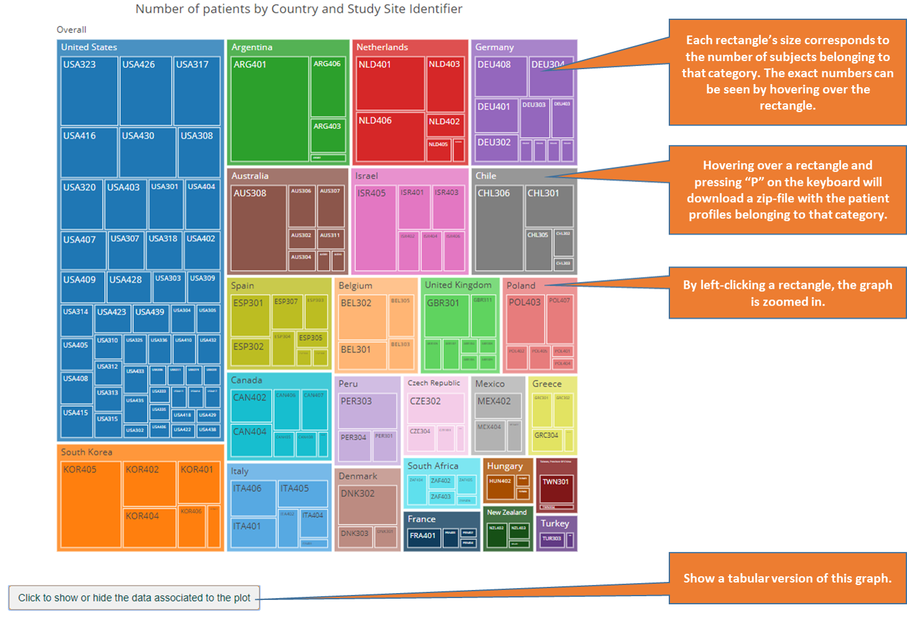

# Introduction

```{r runDocument, echo = FALSE, eval = FALSE, message = FALSE, warning = FALSE}

library(medicalMonitoring)

# currently Js dep for plotly/table should be included manually when rendering the document
rm(list = ls())
system.time(
    bookdown::render_book(
        input = "index.Rmd", 
        clean_envir = FALSE,
        # during template development, these options are set to FALSE:
        new_session = TRUE, clean = FALSE,
        # TODO: find a more generic way to pass params
        # if params are present but not in header, error: 'render params not declared in YAML'
        params = yaml::read_yaml("./_bookdown.yml")[c("study", "version")],
    )
)

```


```{r options, echo = FALSE, message = FALSE, warning = FALSE}

library(knitr)
opts_chunk$set(
    echo = FALSE, 
    warning = FALSE, error = FALSE, message = FALSE, 
    results = "asis",
    cache = FALSE,
    fig.width = 8, fig.height = 7,
    fig.path = "./figures/",
    fig.align = 'center'
)

# print warnings where they occur (warn = 0 by default)
options(warn = 1)

```

```{r loadPackages}

library(medicalMonitoring)

```

**Current data transfer:** `r params$currentDataTransfer`  

**Previous data transfer (used for comparisons):**
`r params$previousDataTransfer`  

This report works best with **Google Chrome**. Please do not use Internet
Explorer or Edge as they do not contain all functionalities.  

Please send questions, requests, suggestions and issues about these reports to
`r toString(params$contactPerson)`.  

The table of contents in the side panel on the left and "<" and ">" buttons on
the left and right side of the main panel can be used to navigate the report. An
**empty page** (with a header) indicates that the data is split in subsections
and you should navigate further to the subsection of interest.  

For **instructions** on how to use the graphs and tables please go to the next
section by either clicking the ">" button on the right, or by selecting
"Tutorial: Subject-level graphs and tables" in the table of contents on the
left.  


```{r getMetadata, dateReportRun = TRUE}

##################################################
## Current metadata associated with this report ##
##################################################
metadataFile <- list.files(
    path = params$pathDataFolder, 
    pattern = "metadata.yml", 
    full.names = TRUE
)
namesInfo <- c(
    "pathSDTMs" = "Original data (SDTM) path:",
    "dateTimeSDTMcreation" = "Data creation date:"
)
if(length(metadataFile) > 0) {
  cat("The **metadata associated with this report** are:\n\n")
  getMetadata(metadataFile, namesInfo = namesInfo)
}
cat("\n\n")
```

```{r getMetadataOld, dateReportRun = FALSE, eval = (! is.null(params$pathDataFolderOld))}

##################################################
## Old metadata associated with comparison data ##
##################################################
metadataFileOldData <- list.files(
    path = params$pathDataFolderOld, 
    pattern = "metadata.yml", 
    full.names = TRUE
)
namesInfo <- c(
    "pathSDTMs" = "Original data (SDTM) path:",
    "dateTimeSDTMcreation" = "Report creation date:"
)
if(length(metadataFileOldData) > 0) {
  cat("The **metadata associated with the comparison data** are:\n\n")
  getMetadata(metadataFileOldData, namesInfo = namesInfo)
}

```


## Tutorial: Subject-level graphs and tables

Subject-level analyses (e.g. spaghettiplots, shiftplots, eDISH,...) are
represented with crosslinked interactive graphs and tables. Patient profiles can
be opened from the graphs as well as the tables. More detailed instructions can
be found in the screenshots below.

### Scatter plots and spaghetti plots


### Linked tables


## Tutorial: Summarized visualizations.

Visualization of summary data (e.g. counts per category) follows the same
principles as highlighted in "Tutorial: Subject-level graphs and tables", some
specifics are mentioned below.  

### Treemap graphs



### Summary tables


